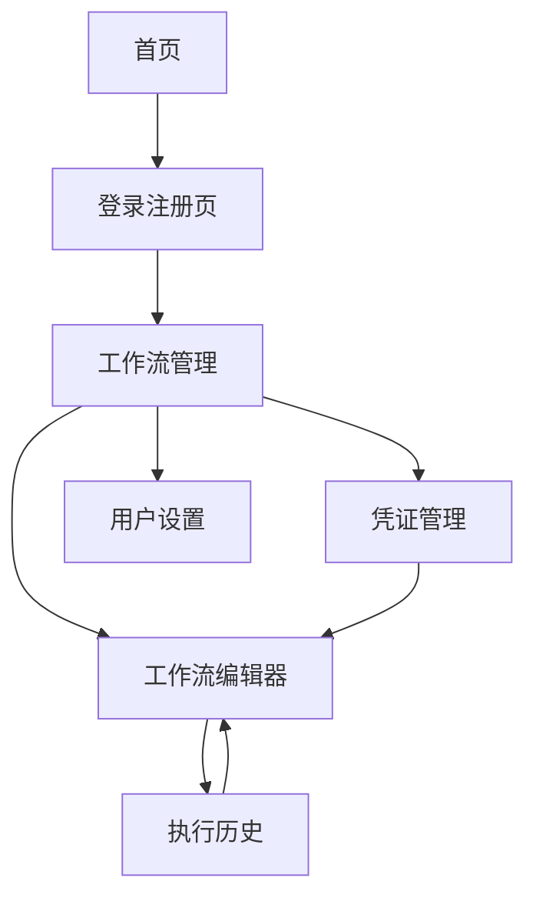

# 工作流自动化平台产品需求文档

## 1. 产品概述
一个基于Web的可视化工作流自动化平台，用户可以通过拖拽和连接节点来创建工作流，实现任务的自动化执行。
- 解决企业和个人在日常工作中重复性任务自动化的需求，提供直观的可视化界面让非技术用户也能轻松创建复杂的自动化流程。
- 目标是成为企业级工作流自动化的首选平台，提升工作效率并降低人工错误率。

## 2. 核心功能

### 2.1 用户角色
| 角色 | 注册方式 | 核心权限 |
|------|----------|----------|
| 普通用户 | 邮箱注册 | 可创建和管理个人工作流，查看执行历史 |
| 企业用户 | 邀请码升级 | 可创建团队工作流，管理团队凭证，查看详细分析报告 |

### 2.2 功能模块
我们的工作流自动化平台包含以下主要页面：
1. **首页**：产品介绍、功能展示、用户登录入口
2. **工作流编辑器**：可视化画布、节点库、属性配置面板
3. **工作流管理**：工作流列表、状态管理、批量操作
4. **执行历史**：执行记录查看、日志详情、性能分析
5. **凭证管理**：API密钥管理、OAuth认证、安全设置
6. **用户设置**：个人信息、账户安全、通知设置
7. **登录注册页**：用户认证、密码重置、邮箱验证

### 2.3 页面详情
| 页面名称 | 模块名称 | 功能描述 |
|----------|----------|----------|
| 首页 | 产品介绍区 | 展示平台核心价值、功能特性、使用案例 |
| 首页 | 导航栏 | 提供登录入口、产品文档链接、联系方式 |
| 工作流编辑器 | 可视化画布 | 支持节点拖拽、连线操作、缩放平移、网格对齐 |
| 工作流编辑器 | 节点库面板 | 分类展示可用节点、搜索过滤、节点说明 |
| 工作流编辑器 | 属性配置面板 | 节点参数设置、条件配置、测试执行 |
| 工作流编辑器 | 工具栏 | 保存、运行、调试、导入导出、版本管理 |
| 工作流管理 | 工作流列表 | 显示所有工作流、状态筛选、搜索排序 |
| 工作流管理 | 批量操作 | 启用禁用、删除、复制、导出工作流 |
| 执行历史 | 执行记录列表 | 显示执行状态、开始结束时间、成功失败统计 |
| 执行历史 | 日志详情 | 查看详细执行日志、错误信息、性能数据 |
| 凭证管理 | 凭证列表 | 管理API密钥、OAuth令牌、连接测试 |
| 凭证管理 | 安全设置 | 加密存储、访问权限、过期提醒 |
| 用户设置 | 个人信息 | 修改用户名、邮箱、头像、时区设置 |
| 用户设置 | 账户安全 | 修改密码、两步验证、登录历史 |
| 登录注册页 | 用户认证 | 邮箱密码登录、第三方登录、记住登录状态 |
| 登录注册页 | 注册流程 | 邮箱注册、邮箱验证、用户协议确认 |

## 3. 核心流程

**普通用户流程：**
用户首先在首页了解产品功能，然后注册登录进入平台。在工作流管理页面可以查看现有工作流或创建新的工作流。点击创建或编辑进入工作流编辑器，通过拖拽节点和连线构建自动化流程。配置完成后保存并运行工作流，可以在执行历史页面查看运行结果和日志。如需使用第三方服务，需要在凭证管理页面配置相应的API密钥。

**企业用户流程：**
企业用户除了具备普通用户的所有功能外，还可以创建团队工作流，管理团队成员的凭证，查看更详细的分析报告和性能指标。

## 4. 用户界面设计

### 4.1 设计风格
- **主色调**：深蓝色(#1976d2)作为主色，浅蓝色(#42a5f5)作为辅助色
- **按钮样式**：圆角矩形按钮，支持悬停和点击状态变化
- **字体**：Roboto字体，标题使用16-24px，正文使用14px，说明文字使用12px
- **布局风格**：卡片式布局，顶部导航栏，左侧边栏导航
- **图标风格**：使用Material Design图标，简洁现代

### 4.2 页面设计概览

| 页面名称 | 模块名称 | UI元素 |
|----------|----------|--------|
| 首页 | 产品介绍区 | 大背景图、渐变色彩、卡片式功能展示、CTA按钮 |
| 工作流编辑器 | 可视化画布 | 深色画布背景、网格线、节点卡片样式、连线动画效果 |
| 工作流管理 | 工作流列表 | 表格布局、状态标签、操作按钮组、分页组件 |
| 执行历史 | 执行记录列表 | 时间轴样式、状态图标、展开折叠详情、搜索过滤器 |
| 凭证管理 | 凭证列表 | 安全卡片样式、遮罩显示敏感信息、测试连接状态指示 |
| 用户设置 | 个人信息 | 表单布局、头像上传组件、保存确认提示 |

### 4.3 响应式设计
平台采用桌面优先的设计策略，同时适配平板和移动设备。工作流编辑器在移动端提供简化的触控操作界面，支持手势缩放和拖拽操作。