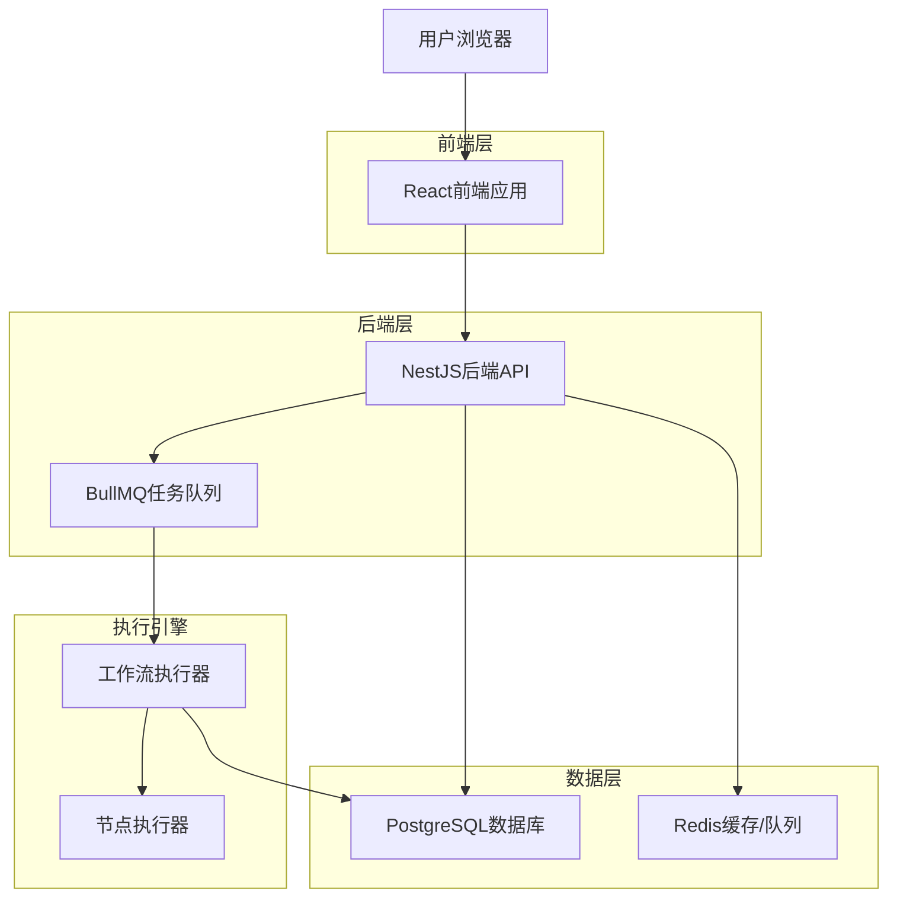
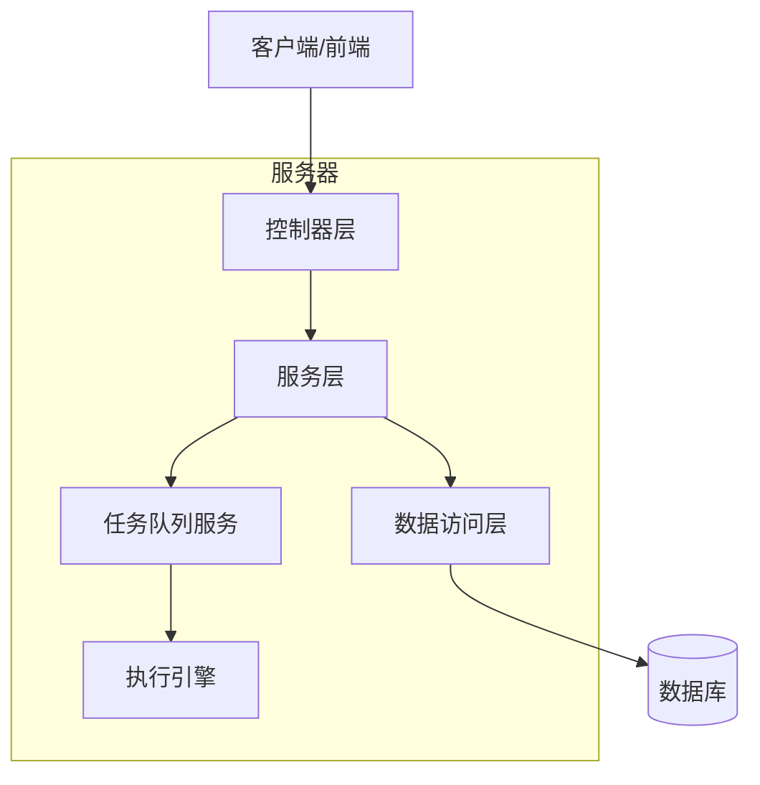
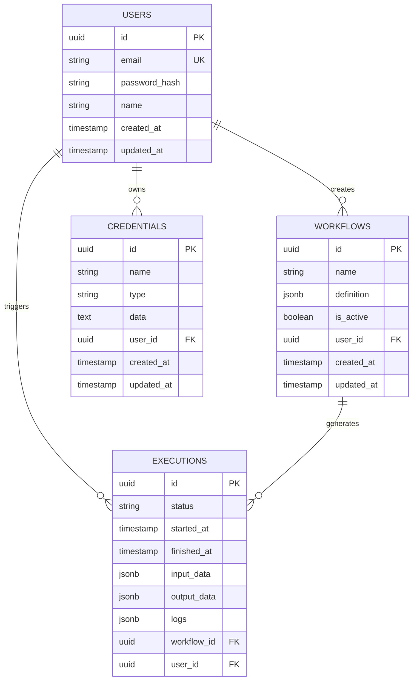

# 工作流自动化平台技术架构文档

## 1. 架构设计



## 2. 技术描述

- 前端：React@18 + TypeScript@5 + Vite@5 + React Flow@11 + Zustand@4 + MUI@5 + Tailwind CSS@3
- 后端：Node.js@20 + NestJS@10 + TypeScript@5 + Prisma@5
- 数据库：PostgreSQL@15 + Redis@7
- 任务队列：BullMQ@4
- 身份验证：JWT + Passport
- 容器化：Docker + Docker Compose

## 3. 路由定义

| 路由 | 用途 |
|------|------|
| / | 首页，展示产品介绍和登录入口 |
| /login | 登录页面，用户身份验证 |
| /register | 注册页面，新用户注册 |
| /dashboard | 仪表板，工作流概览和快速操作 |
| /workflows | 工作流管理页面，显示所有工作流 |
| /workflows/:id/edit | 工作流编辑器，可视化编辑界面 |
| /executions | 执行历史页面，查看运行记录 |
| /executions/:id | 执行详情页面，查看具体执行日志 |
| /credentials | 凭证管理页面，管理API密钥 |
| /settings | 用户设置页面，个人信息和偏好 |

## 4. API定义

### 4.1 核心API

**用户认证相关**
```
POST /api/auth/register
```

请求参数：
| 参数名 | 参数类型 | 是否必需 | 描述 |
|--------|----------|----------|------|
| email | string | true | 用户邮箱 |
| password | string | true | 用户密码 |
| name | string | true | 用户姓名 |

响应参数：
| 参数名 | 参数类型 | 描述 |
|--------|----------|------|
| success | boolean | 注册是否成功 |
| message | string | 响应消息 |
| user | object | 用户信息 |

```
POST /api/auth/login
```

请求参数：
| 参数名 | 参数类型 | 是否必需 | 描述 |
|--------|----------|----------|------|
| email | string | true | 用户邮箱 |
| password | string | true | 用户密码 |

响应参数：
| 参数名 | 参数类型 | 描述 |
|--------|----------|------|
| access_token | string | JWT访问令牌 |
| user | object | 用户信息 |

**工作流管理相关**
```
GET /api/workflows
POST /api/workflows
GET /api/workflows/:id
PUT /api/workflows/:id
DELETE /api/workflows/:id
POST /api/workflows/:id/execute
```

**执行记录相关**
```
GET /api/executions
GET /api/executions/:id
DELETE /api/executions/:id
```

**凭证管理相关**
```
GET /api/credentials
POST /api/credentials
PUT /api/credentials/:id
DELETE /api/credentials/:id
POST /api/credentials/:id/test
```

## 5. 服务器架构图



## 6. 数据模型

### 6.1 数据模型定义



### 6.2 数据定义语言

**用户表 (users)**
```sql
-- 创建用户表
CREATE TABLE users (
    id UUID PRIMARY KEY DEFAULT gen_random_uuid(),
    email VARCHAR(255) UNIQUE NOT NULL,
    password_hash VARCHAR(255) NOT NULL,
    name VARCHAR(100) NOT NULL,
    created_at TIMESTAMP WITH TIME ZONE DEFAULT NOW(),
    updated_at TIMESTAMP WITH TIME ZONE DEFAULT NOW()
);

-- 创建索引
CREATE INDEX idx_users_email ON users(email);
CREATE INDEX idx_users_created_at ON users(created_at DESC);
```

**工作流表 (workflows)**
```sql
-- 创建工作流表
CREATE TABLE workflows (
    id UUID PRIMARY KEY DEFAULT gen_random_uuid(),
    name VARCHAR(255) NOT NULL,
    definition JSONB NOT NULL,
    is_active BOOLEAN DEFAULT true,
    user_id UUID NOT NULL,
    created_at TIMESTAMP WITH TIME ZONE DEFAULT NOW(),
    updated_at TIMESTAMP WITH TIME ZONE DEFAULT NOW(),
    CONSTRAINT fk_workflows_user_id FOREIGN KEY (user_id) REFERENCES users(id) ON DELETE CASCADE
);

-- 创建索引
CREATE INDEX idx_workflows_user_id ON workflows(user_id);
CREATE INDEX idx_workflows_is_active ON workflows(is_active);
CREATE INDEX idx_workflows_created_at ON workflows(created_at DESC);
```

**凭证表 (credentials)**
```sql
-- 创建凭证表
CREATE TABLE credentials (
    id UUID PRIMARY KEY DEFAULT gen_random_uuid(),
    name VARCHAR(255) NOT NULL,
    type VARCHAR(50) NOT NULL CHECK (type IN ('api_key', 'oauth2', 'basic_auth')),
    data TEXT NOT NULL, -- 存储加密后的凭证数据
    user_id UUID NOT NULL,
    created_at TIMESTAMP WITH TIME ZONE DEFAULT NOW(),
    updated_at TIMESTAMP WITH TIME ZONE DEFAULT NOW(),
    CONSTRAINT fk_credentials_user_id FOREIGN KEY (user_id) REFERENCES users(id) ON DELETE CASCADE
);

-- 创建索引
CREATE INDEX idx_credentials_user_id ON credentials(user_id);
CREATE INDEX idx_credentials_type ON credentials(type);
```

**执行记录表 (executions)**
```sql
-- 创建执行记录表
CREATE TABLE executions (
    id UUID PRIMARY KEY DEFAULT gen_random_uuid(),
    status VARCHAR(20) NOT NULL CHECK (status IN ('running', 'succeeded', 'failed', 'cancelled')),
    started_at TIMESTAMP WITH TIME ZONE DEFAULT NOW(),
    finished_at TIMESTAMP WITH TIME ZONE,
    input_data JSONB,
    output_data JSONB,
    logs JSONB DEFAULT '[]'::jsonb,
    workflow_id UUID NOT NULL,
    user_id UUID NOT NULL,
    CONSTRAINT fk_executions_workflow_id FOREIGN KEY (workflow_id) REFERENCES workflows(id) ON DELETE CASCADE,
    CONSTRAINT fk_executions_user_id FOREIGN KEY (user_id) REFERENCES users(id) ON DELETE CASCADE
);

-- 创建索引
CREATE INDEX idx_executions_workflow_id ON executions(workflow_id);
CREATE INDEX idx_executions_user_id ON executions(user_id);
CREATE INDEX idx_executions_status ON executions(status);
CREATE INDEX idx_executions_started_at ON executions(started_at DESC);
```

**初始化数据**
```sql
-- 插入示例用户
INSERT INTO users (email, password_hash, name) VALUES 
('admin@example.com', '$2b$10$example_hash', '管理员'),
('user@example.com', '$2b$10$example_hash', '普通用户');

-- 插入示例工作流
INSERT INTO workflows (name, definition, user_id) 
SELECT 
    '示例工作流',
    '{"nodes": [], "edges": []}'::jsonb,
    id 
FROM users WHERE email = 'admin@example.com';
```